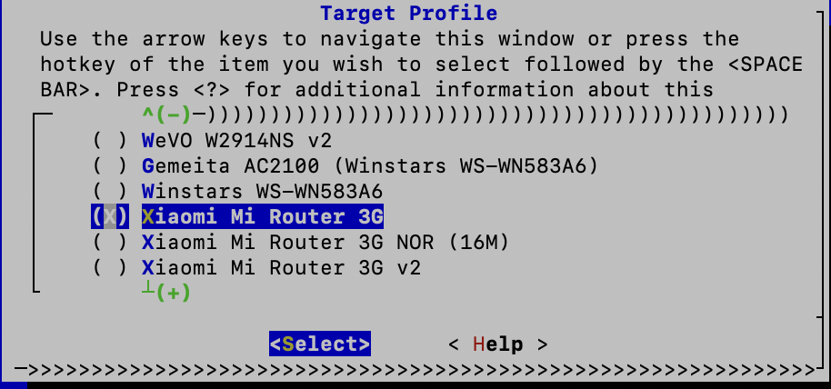

# 编译教程

很多人不知道怎样编译一个自己的固件，这里主要简单介绍大概的编译打包流程，具体的情况还需要大家自己发挥，情况千变万化，大家随机应变。

## 1 编译准备
我们建议使用[Ubuntu](https://www.ubuntu.com/)系统作为编译环境，这里以Ubuntu 18.04作为例子，其他版本也是可以的。特别注意的是，整个编译过程，都是用普通用户操作，不要用`root`用户操作。

首先要安装编译所需要的软件包:
`sudo apt install build-essential ecj fastjar file flex g++ gcc-multilib g++-multilib gawk gettext git git-core java-propose-classpath libelf-dev libncurses5-dev libncursesw5-dev libssl-dev python python3 python3-distutils subversion unzip wget zlib1g-dev rsync qemu-utils`

下载源码:
```sh
git clone https://github.com/x-wrt/x-wrt.git
cd x-wrt

#更新代码tag:
git fetch origin

#列出可以使用的版本tag:
git tag
#注意摁 q 键结束
#或者直接获取最新发布版本
git describe --tags $(git rev-list --tags --max-count=1)

#选择并切换到指定的版本tag:
git checkout -f <tag-name>
#例如
git checkout -f 21.10_b202112032317
#或者
git checkout -f $(git describe --tags $(git rev-list --tags --max-count=1))

#更新代码:
./scripts/feeds update -a
./scripts/feeds install -a
```

配置固件的命令`make menuconfig` 但是我们可以从配置模版开始会更轻松一些。

比如ramips-mt7621的设备可以用拷贝这个模版`feeds/x/rom/lede/config.ramips-mt7621`
内核分区限制小的设备，选用 `-nosymbol` 结尾的`config`配置模版
```sh
cp feeds/x/rom/lede/config.ramips-mt7621 .config
```

由于这些模版是用来编译大量设备的，copy过来后，可以直接编译，不做任何改变。
但是如果需要改变，需要`make menuconfig`自定义，就要做下面的操作:
```sh
# 上面已经cp 拷贝了模版配置到 .config
# 例如 cp feeds/x/rom/lede/config.ramips-mt7621 .config
# 下面继续操作和修改

#1 执行
make menuconfig

#2 进入 Target Profile 选择需要编译打包的设备型号，选择型号后立刻退出，保存
```



```sh
#3 执行下面的命令修复 .config
sh feeds/x/rom/lede/fix-config.sh

#4 再次执行 make menuconfig 然后立刻退出保存

#5 最后一次 执行 make menuconfig 自定义选择你需要的软件包

```

还有更多配置模版，请参考目录下的`config.*`文件:
```
feeds/x/rom/lede/config.ath79-generic
feeds/x/rom/lede/config.ath79-generic-nosymbol
feeds/x/rom/lede/config.ath79-nand
feeds/x/rom/lede/config.bcm27xx-bcm2709
feeds/x/rom/lede/config.bcm27xx-bcm2710
feeds/x/rom/lede/config.bcm27xx-bcm2711
feeds/x/rom/lede/config.bcm4908-generic
feeds/x/rom/lede/config.bcm53xx-generic
feeds/x/rom/lede/config.ipq40xx-generic
feeds/x/rom/lede/config.ipq806x-generic
feeds/x/rom/lede/config.kirkwood-generic
feeds/x/rom/lede/config.mediatek-mt7622
feeds/x/rom/lede/config.mvebu-cortexa53
feeds/x/rom/lede/config.mvebu-cortexa9
feeds/x/rom/lede/config.ramips-mt7620
feeds/x/rom/lede/config.ramips-mt7620-nosymbol
feeds/x/rom/lede/config.ramips-mt7621
feeds/x/rom/lede/config.ramips-mt76x8
feeds/x/rom/lede/config.ramips-mt76x8-nosymbol
feeds/x/rom/lede/config.ramips-rt305x
feeds/x/rom/lede/config.ramips-rt3883-nosymbol
feeds/x/rom/lede/config.rockchip-armv8
feeds/x/rom/lede/config.sunxi-cortexa7
feeds/x/rom/lede/config.x86_64
feeds/x/rom/lede/config.x86_64-docker
feeds/x/rom/lede/config.x86_generic
```

## 2. 配置目标
在上述准备好的模版配置文件的基础上，执行`make menuconfig`命令进行个性化定制，增删应用。

定位到各个子菜单，选择对应的软件包


## 3. 执行编译
命令:
```sh
make
```
或者
```sh
make -j1 V=s
```

生成的包在`bin/targets/`下面


如果需要再次修改配置编译，只要不是换设备，都可以直接 `make menuconfig` 修改后就编译，如果需要修改设备，请从拷贝模版配置的地方重新开始配置。


## 3. 高阶配置
为了得到满意的固件，下面对编译配置选项做更多的详细说明，但是更多的可能并不局限于这些说明内容，还有更多期待大家自己探索。

### 3.1 选择应用
首先，进入`make menuconfig`菜单

**要编译到固件里面，就要选择`<*>`，如果只选择`<M>`只是编译成软件包`ipk`，不会打包进入固件。**

进入`LuCI - Applications`子菜单下面，选择自己想要的应用

常见的软件包:
```
luci-app-aria2 ARRIA2下载工具
luci-app-ddns DDNS工具
luci-app-mwan3 MWAN3负载均衡
luci-app-nft-qos 流量控制
luci-app-openvpn OPENVPN
luci-app-samba SAMBA网络共享
luci-app-upnp UPNP设置
luci-app-wireguard WireGuard配置界面
luci-app-natcap 远程界面管理模块和全锥形nat实现模块
```

进入`Kernel modules - USB Support`菜单，选择USB支持的驱动

进入`Kernel modules - Filesystems`菜单，选择需要支持的文件系统，比如`ext4,ntfs,vfat`等

进入`Kernel modules - Wireless Drivers`菜单，选择无线支持的驱动，如果需要挂卡的驱动，也是在这里找

### 3.2 关于natcap远程管理模块
这个是远程界面管理(http://x-wrt.dev/) 模块和全锥形nat实现模块，鉴于有些朋友不喜欢被远程管理，这里说明下，请自行选择是否需要这个模块。

编译选择不集成这个模块，可以:
```
# 修改.config文件，删去掉这几个模块
CONFIG_PACKAGE_luci-app-natcap=y
CONFIG_PACKAGE_natcapd-client=y
CONFIG_PACKAGE_natcapd-server=y
CONFIG_PACKAGE_natcapd=y
CONFIG_PACKAGE_kmod-natcap=y

# 为了单独让natflow工作，选择下面的包
CONFIG_PACKAGE_natflow-boot=y
```
